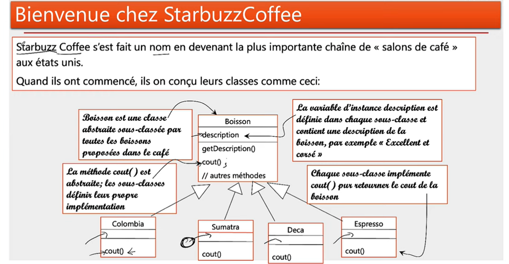
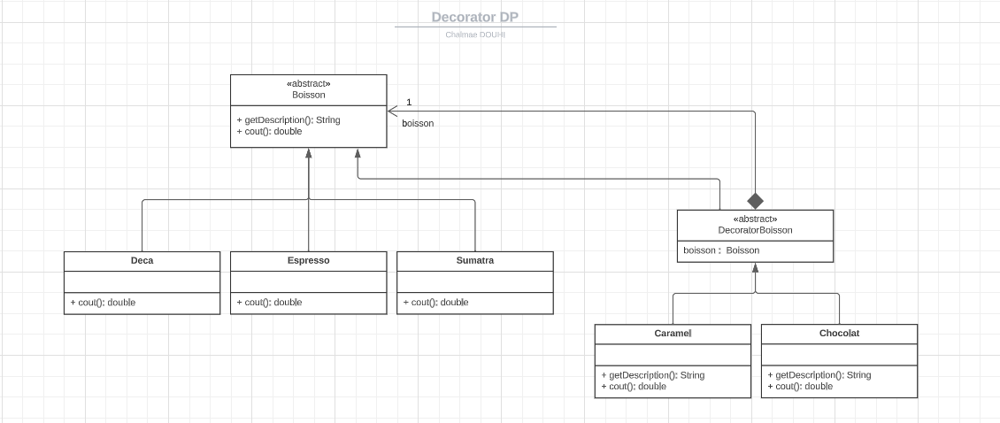

## **<span style="color:purple; font-size:larger;">Decorator Pattern</span>**
### Description
The decorator pattern is a design pattern that allows behavior to be added to an individual object, dynamically, without affecting the behavior of other objects from the same class. The decorator pattern is often useful for adhering to the Single Responsibility Principle, as it allows functionality to be divided between classes with unique areas of concern.
### Application
In this example, we will create a coffee shop application that allows you to order coffee and add ingredients to it. The decorator pattern will be used to add ingredients to the coffee.


En plus de votre café vous puvez également demandaer plusieur ingrédients comme: 
* du lait
* du chocolat
* du sirop
* de la vanille
* du caramel
* etc.

Starbuzz Coffee, facturant chacun de ces suppléments, a besoin d'un moyen de les intégrer dans le système de commande.

Le décorateur permet d'ajouter des fonctionnalités à un objet sans modifier son code source.

### Class Diagram


### Implementation
#### Boisson class
This class is the base class for all the drinks

```java
public abstract class Boisson {
    protected String description;

    public Boisson(){

    }

    public String getDescription() {
        return description;
    }

    public abstract double cout();
}
```
#### Deca class
```java
public class Deca extends Boisson {
    public Deca(){
        description = "Deca";
    }
     @Override
    public double cout() {
        return 16;
    }
}
```
#### Espresso class
```java
public class Espresso extends Boisson {
    public Espresso(){
        description = "Espresso";
    }
    @Override
    public double cout() {
        return 20;
    }
}
```
#### Sumatra class
```java
public class Sumatra extends Boisson {
    public Sumatra(){
        description = "Sumatra";
    }
    @Override
    public double cout() {
        return 6;
    }
}
```
#### DecoratorBoisson class
This class is the base class for all the decorators. It extends the Boisson class and has a Boisson object as an attribute.

```java
public abstract class DecoratorBoisson extends Boisson {
    protected Boisson boisson;

    public DecoratorBoisson(Boisson boisson) {
        this.boisson = boisson;
    }
}
```
#### Chocolat class
```java
public class Chocolat extends DecoratorBoisson {
    public Chocolat(Boisson boisson) {
        super(boisson);
    }

    @Override
    public String getDescription() {
        return boisson.getDescription() + " au chocolat";
    }

    @Override
    public double cout() {
        return 0.3 + boisson.cout();
    }
}
```
#### Caramel class
```java
public class Caramel extends DecoratorBoisson {
    public Caramel(Boisson boisson) {
        super(boisson);
    }

    @Override
    public String getDescription() {
        return boisson.getDescription() + " au caramel";
    }

    @Override
    public double cout() {
        return 0.8 + boisson.cout();
    }
}
```

#### Main class
```java
public class Test {
    public static void main(String[] args) {

        Boisson boisson;
        boisson = new Sumatra();
        System.out.println(boisson.getDescription());
        System.out.println(boisson.cout());

        boisson = new Chocolat(new Caramel(new Chocolat(boisson)));
        System.out.println(boisson.getDescription());
        System.out.println(boisson.cout());
    }
}
```
#### Output


### Conclusion
The decorator is a structural design pattern that allows you to attach new responsibilities to an object by providing a flexible way to add it at runtime. The decorator allows you to add functionality to an object without modifying its source code.


